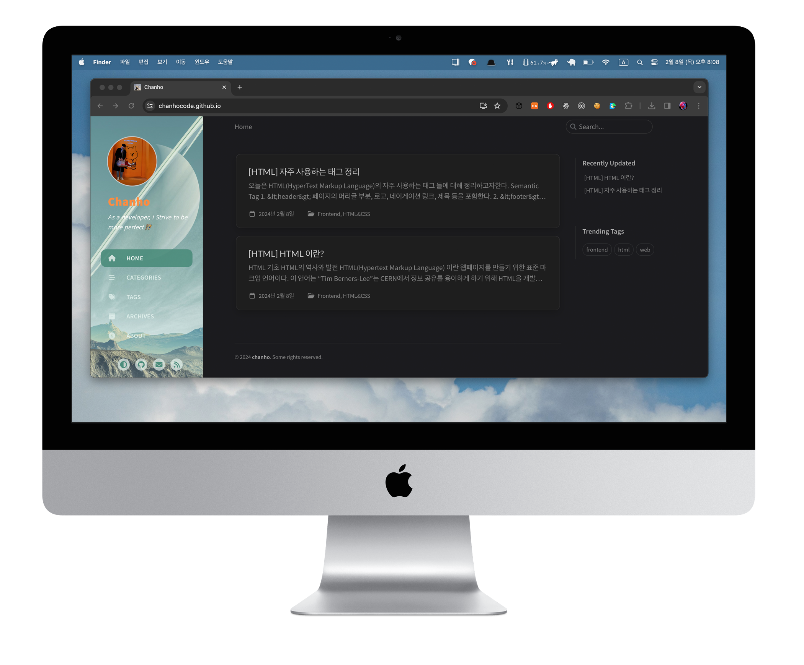

# Chanho's Blog

<a href="https://chanhocode.github.io/">
  👉 move on click: Blog
</a>

---



---

✈️ Rule

## 블로그 로컬 확인

```
$ bundle exec jekyll serve
```

## 게시글 작성

- 최상단에 작성

```
---
title: "[HTML] 자주 사용하는 태그 정리"
writer: chanho
date: 2024-02-08 18:44:00 +0900
categories: [Frontend, HTML&CSS]
tags: [frontend, web, html]
---
```

## Commit Rule

```
Write: 게시글 작성
Modified: 게시글 수정
Delete: 게시글 삭제

Feat: 기능 추가
Fix: 기능 수정
Remove: 기능 제거
```
